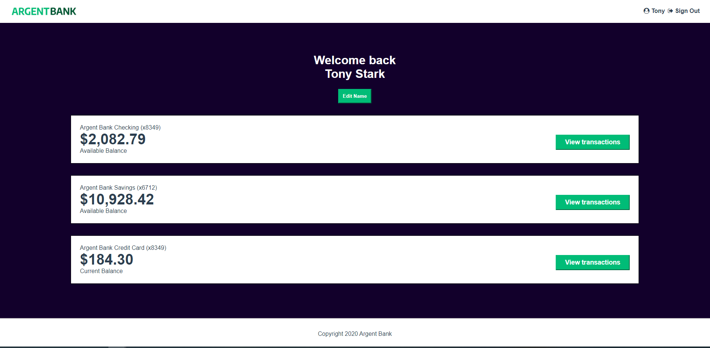

# AgentBank - OCR

Project de formation chez OpenClassRoom.

# Langage solicité

- SASS
- REACT
- REDUX

# Objectif

- S'authentifier à une API
- Implémenter un gestionnaire d'état dans une application React
- Intéragir avec une API
- Modéliser une API

# Visiter

[Voir le Rendu](https://nerion-1337.github.io/AgentBank-OCR/)

# Aperçu

